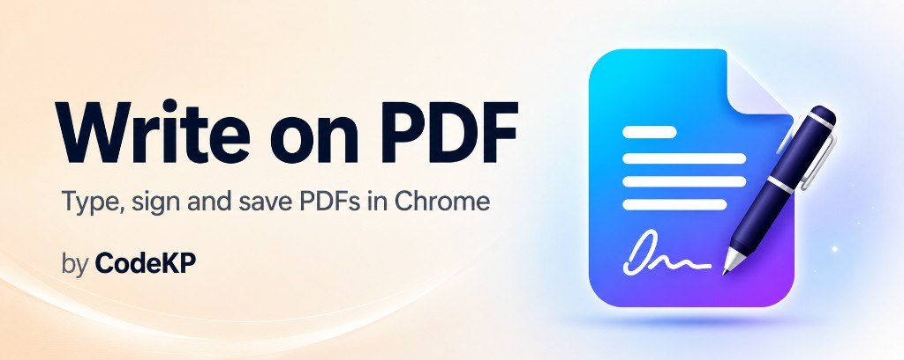
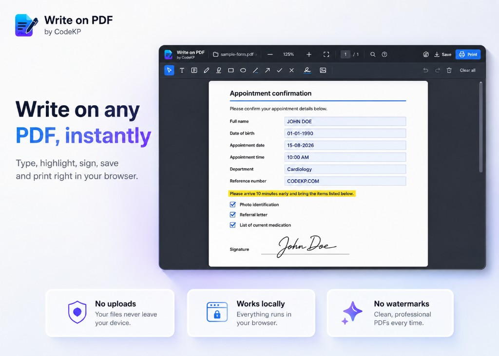
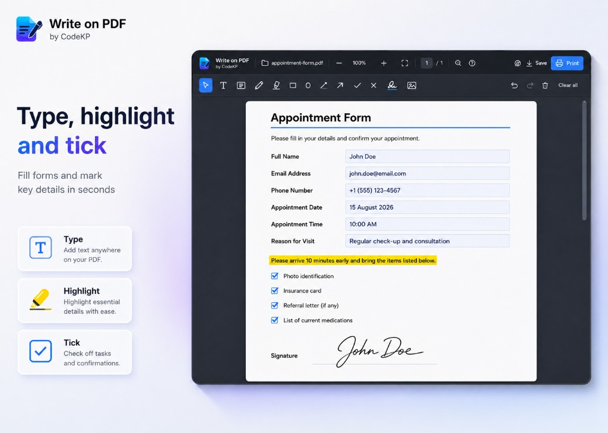
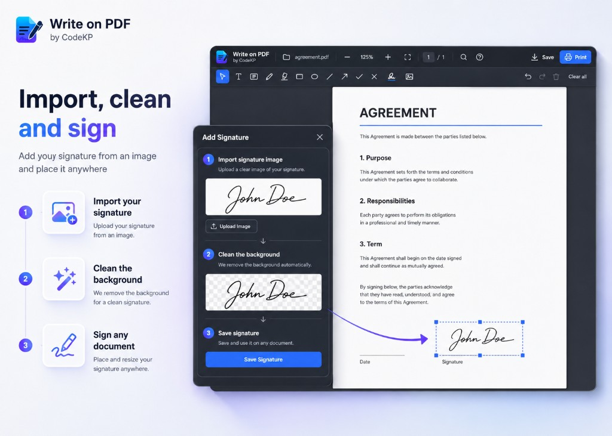
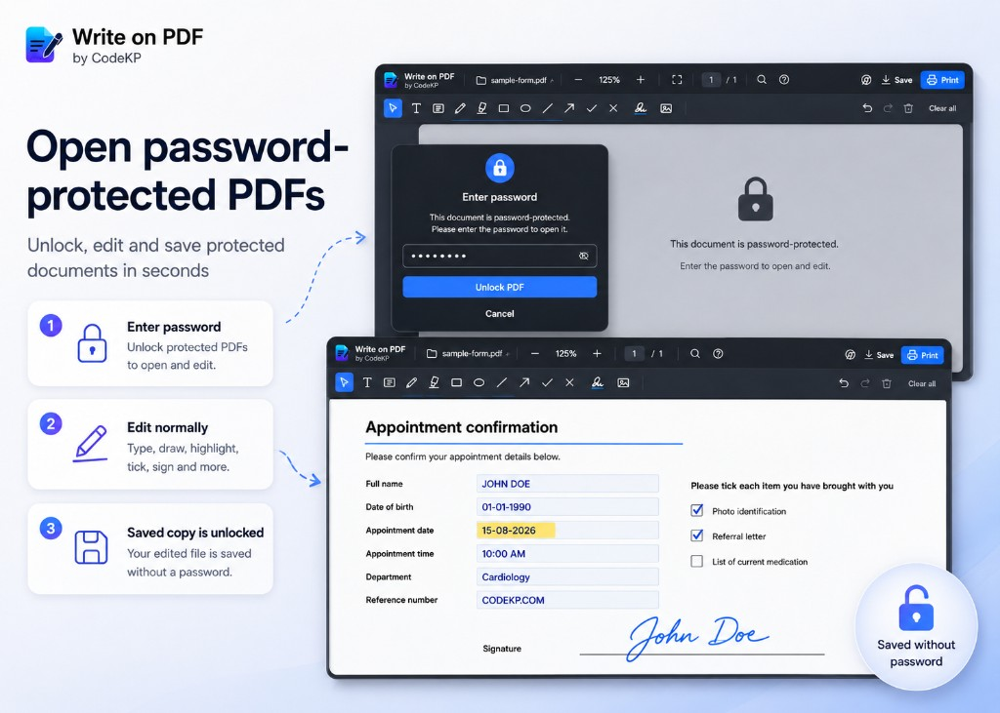
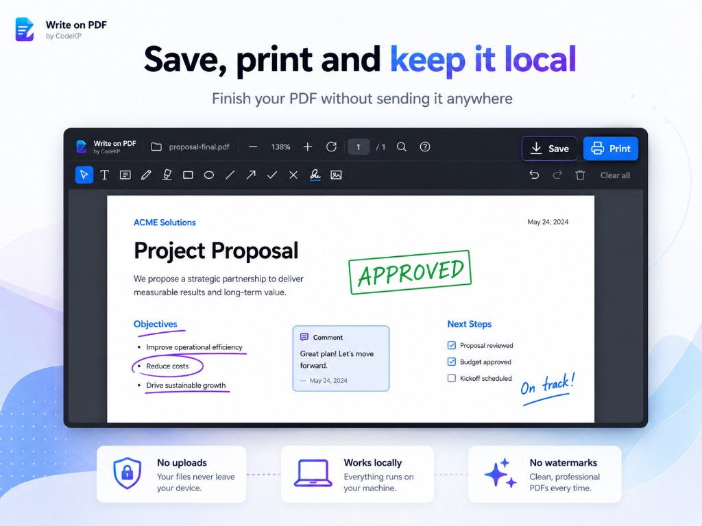

  

  <b>Write, draw, sign, highlight, save and print PDFs directly in Chrome, Edge or Firefox. Private, local and free.</b>

  
  
  
  

  <a href="https://chromewebstore.google.com/detail/write-on-pdf/gleppfjgfdailpkclgfmojbeemmepinh">Chrome Web Store</a> ·
  <a href="https://codekp.com/apps/write-on-pdf/">Try the live editor</a> ·
  <a href="https://codekp.com/apps/write-on-pdf/privacy.html">Privacy</a> ·
  <a href="https://github.com/TheCodeKP/Write-on-PDF/releases">Releases</a> ·
  <a href="CHANGELOG.md">Changelog</a>

---

A free extension for Chrome, Microsoft Edge and Firefox that opens PDFs in its own editor so you can type on them, highlight, sign, then print or save. Your files stay on your machine. Nothing is uploaded, there is no account, and there is no analytics of any kind.

**What's new in 1.2:** password-protected PDFs (saved copy is unlocked) and shared Chrome, Edge and Firefox builds. On [GitHub](https://github.com/TheCodeKP/Write-on-PDF/releases) now; Chrome, Edge and Firefox store updates are in review. The Chrome Web Store listing today is still **1.0.0**.

## What it looks like

## Install

**Chrome Web Store (1.0.0).** [Add it to Chrome](https://chromewebstore.google.com/detail/write-on-pdf/gleppfjgfdailpkclgfmojbeemmepinh).

**GitHub (1.2.0).** Download a browser zip from [Releases](https://github.com/TheCodeKP/Write-on-PDF/releases/latest) (`write-on-pdf-chrome-1.2.0.zip`, `write-on-pdf-edge-1.2.0.zip`, or `write-on-pdf-firefox-1.2.0.zip`), or clone this repository, then load unpacked:

1. Open `chrome://extensions` (Chrome), `edge://extensions` (Edge), or `about:debugging#/runtime/this-firefox` (Firefox).
2. On Chrome or Edge, turn on **Developer mode** (top right), then **Load unpacked** and select the unzipped folder. On Firefox, choose **Load Temporary Add-on…** and select `manifest.json` inside the unzipped folder.
3. For local files and finished downloads: on Chrome or Edge, turn on **Allow access to file URLs** on the extension card. On Firefox, open **about:addons**, find Write on PDF, open **Permissions and data**, and turn on **Access local files on your computer** (temporary add-ons may not show that switch until a signed build is installed).

**Try on the site.** The same editor runs on [codekp.com](https://codekp.com/apps/write-on-pdf/), with no install.

## Tools

Pick a tool from the second toolbar row; it stays active until you pick another.

Having a tool in hand does not lock you out of what is already on the page. A plain click picks up whatever is under it, so you can fix a word or recolour a shape without going back to Select first. Moving the hand still draws, which is what keeps a stroke over an earlier stroke a stroke rather than a drag.

| Tool | Key | What it does |
| --- | --- | --- |
| Select | `V` | Move and resize what is already there, and select page text. |
| Text | `T` | Click and type on one line. Font, size, bold, italic, underline, strikethrough, colour, highlight behind the text. |
| Text box | `W` | Drag out a width and type. The text wraps inside it and the box grows downwards as you fill it. |
| Pen | `P` | Draw freehand. Stamped as vectors, so it stays sharp at any zoom and can be moved or resized afterwards. |
| Highlighter | `H` | Drag a translucent band over text. Drag only, no click. Always stamped underneath your other notes. |
| Rectangle | `B` | Outline a region, with an optional fill. |
| Ellipse | `O` | Circle something, with an optional fill. |
| Line | `L` | A plain rule. |
| Arrow | `A` | Point at something. |
| Tick | `K` | A check mark. |
| Cross | `X` | An X mark. |
| Signature | `S` | Place a saved signature, drawn or imported from a photo. |
| Image | `I` | Drop in any picture, as its own tool rather than a corner of Signature. |

### Marking up text you have selected

With Select in hand, drag across words on the page as you would anywhere else. A small bar appears offering **Highlight**, **U** and **S**, which lay a highlight, an underline or a strikethrough over exactly the lines you picked out. Each one is an ordinary annotation afterwards: recolour it, move it, undo it.

### Signing

Press `S`. Draw a signature or use a PNG, JPEG or WebP image. **Remove the paper background** fades a photo of ink on paper so only the signature lands. Saved signatures stay available across documents.

## Also included

- Find across the document (`Ctrl+F`)
- Multi select for text notes, then align their edges or restyle them together
- Copy, cut and paste for annotations (`Ctrl+C` / `Ctrl+X` / `Ctrl+V`)
- Undo / redo (`Ctrl+Z` / `Ctrl+Shift+Z`)
- Zoom, fit to window, rotate
- Print (`Ctrl+P`) and save a copy (`Ctrl+S`)
- The full shortcut list at `?`
- Handlee, Indie Flower and Patrick Hand handwriting fonts, alongside Helvetica, Times and Courier
- Notes and reading position remembered per document

Notes are stamped as real text and vectors, not a screenshot of the page.

## Privacy

No server, no accounts, no analytics, no network calls at runtime. Your PDFs, signatures and preferences live in the browser's own storage on your device. Saving a password-protected PDF writes an unlocked copy. Printing decrypts in memory for the print dialog and does not download a file. The full policy is in [PRIVACY.md](PRIVACY.md).

## Turning it off

Click the extension icon:

- **Open PDFs in the editor** is the master switch.
- **Include downloaded PDFs** controls whether finishing a PDF download opens the editor.
- **Open this tab's PDF in the editor** is the rescue button for anything that slipped through.

## Known limits

- Chrome's PDF setting should stay on **Open PDFs in Chrome** (on Edge, keep PDFs opening in the browser).
- Some restricted pages cannot run content scripts; use the popup rescue button.
- On Firefox, opening a PDF already saved as a `file://` path from disk is limited: the extension cannot always read those bytes the way Chrome can with file URL access. Prefer opening the PDF from a web link, or drop the file into the editor.
- Some "Save Link As" downloads are HTML stubs or blocked responses rather than real PDFs (common with hotlink protection). The extension opens the editor only when the saved bytes look like a PDF.
- Stamped text uses Helvetica, Times, Courier or a handwriting face (Latin-1). Characters outside that set may show as `?`.
- Handwriting faces ship as a single weight, so Bold and Italic are unavailable while one is chosen.
- Password-protected PDFs ask for the password, then you can annotate as usual. Saving writes an unlocked copy: the password and restrictions are removed from that file. Save shows a one-time warning before the download. Printing decrypts the PDF in memory for the print dialog; it does not download a file.

## Releases

Every version is tagged and released here, with notes written from [CHANGELOG.md](CHANGELOG.md).

- [1.2.0](https://github.com/TheCodeKP/Write-on-PDF/releases/tag/v1.2.0), 9 August 2026. Password-protected PDFs and shared Chrome, Edge and Firefox builds. On GitHub; Chrome, Edge and Firefox store updates in review.
- [1.1.0](https://github.com/TheCodeKP/Write-on-PDF/releases/tag/v1.1.0), 7 August 2026. Signatures, images, text boxes, handwriting, pen, shapes, find, multi select, copy and paste.
- [1.0.0](https://github.com/TheCodeKP/Write-on-PDF/releases/tag/v1.0.0), 6 August 2026. First public build. Live on the [Chrome Web Store](https://chromewebstore.google.com/detail/write-on-pdf/gleppfjgfdailpkclgfmojbeemmepinh).

## Feedback

Found a PDF it handles badly, or want a tool that is missing? Open an [issue](https://github.com/TheCodeKP/Write-on-PDF/issues) or write to <hi@codekp.com>.

## Licence

GPL-3.0. See [LICENSE](LICENSE).

PDF.js, pdf-lib, Cantoo pdf-lib and fontkit ship under `vendor/` with their own licences. The handwriting fonts are under the Open Font Licence; the licence travels with them in `vendor/fonts/OFL.txt`.
